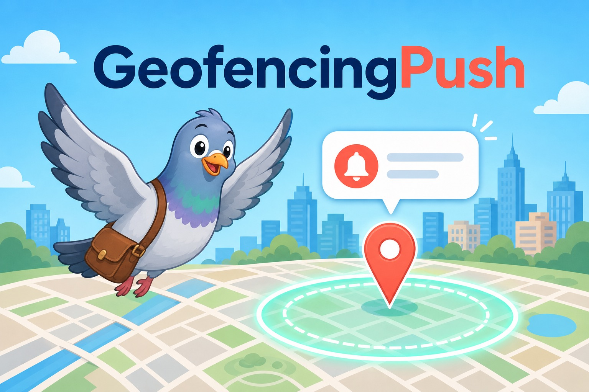

# GeofencingPush

    



A 2017 iOS sample app demonstrating **geofenced push notifications**: a remote push from NIFTY Cloud mobile backend (NCMB) carries a `locationId`, the app fetches that location's coordinates and radius from NCMB, and the notification is only surfaced to the user when they are inside the geofence.

## How It Works

1. The app registers for remote notifications and saves its device token as an NCMB `Installation` (with duplicate-token recovery).
2. A silent-capable remote push arrives with `locationId` (and optional `radius`, `title`, `body`/`message`, `sound`).
3. The app fetches the `Location` object from NCMB and builds a `CLCircularRegion` from its `geo` point.
4. Delivery depends on app state:
   - **Foreground**: resolves the current location via GPSKit and shows a `UIAlertController` only if the user is within the radius.
   - **Background** (iOS 10+): schedules a `UNNotificationRequest` with a `UNLocationNotificationTrigger`, so iOS fires it on region entry.
   - **Background** (iOS 8–9): falls back to a region-triggered `UILocalNotification`.

## Requirements

- Xcode with an iOS 8.0+ deployment target (built against the iOS 10 SDK era)
- CocoaPods 1.2.x
- An NCMB (NIFTY Cloud mobile backend) account — API keys in `AppDelegate.m` are placeholders and must be replaced
- Push notification entitlements / APNs certificate

## Setup

```sh
pod install
open GeofencingPush.xcworkspace
```

Then replace `NCMB_APPLICATION_KEY` / `NCMB_CLIENT_KEY` in `GeofencingPush/AppDelegate.m` with your own keys.

## Project Structure

- `GeofencingPush/AppDelegate.m` — all geofencing/push logic (registration, NCMB fetch, region-triggered notification)
- `GeofencingPush/ViewController.m` — empty placeholder view controller
- `Podfile` — NCMB (from git) + GPSKit

## Status

Legacy sample (2017). NIFTY Cloud mobile backend has since been rebranded (ニフクラ mobile backend), and the iOS 8/9 code paths use long-deprecated APIs. Kept as a reference implementation of `UNLocationNotificationTrigger`-based geofenced push.
